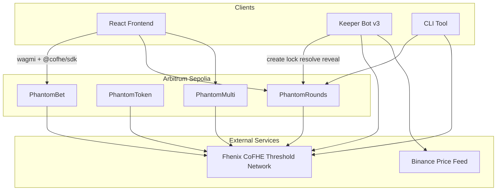
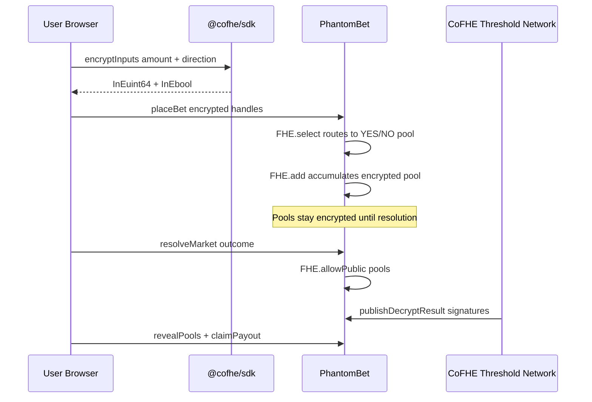
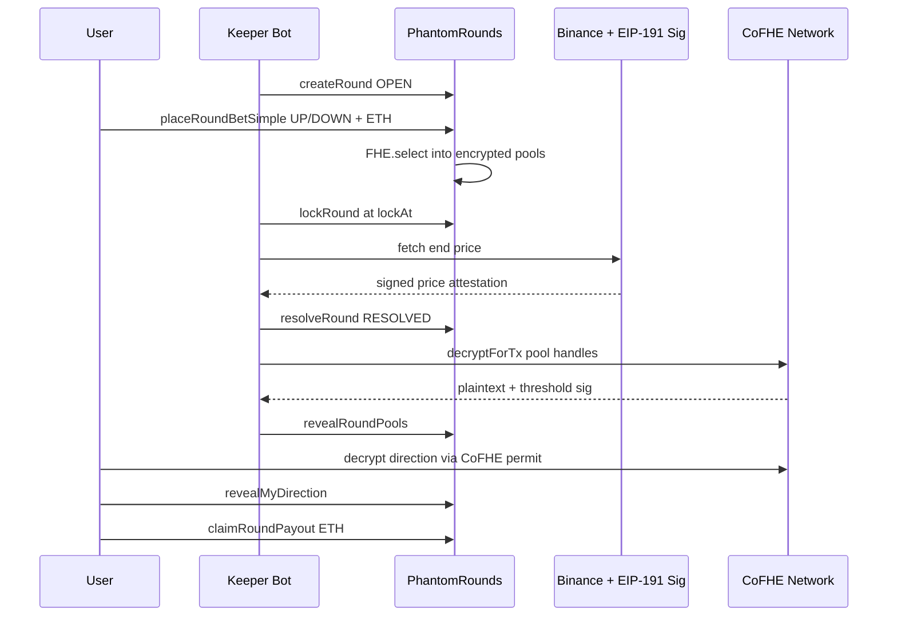

# PHANTOM Protocol

**Fully homomorphic encrypted prediction markets and automated price rounds on Arbitrum Sepolia.**

[](https://phantom-protocol-chi.vercel.app/)
[](https://sepolia.arbiscan.io/address/0x561428264991044f47705C92CE482E37C9cD71b7)
[](https://soliditylang.org)
[](#testing)
[](LICENSE)

> *Your position is real — but invisible on-chain.*

**Live app:** [https://phantom-protocol-chi.vercel.app/](https://phantom-protocol-chi.vercel.app/)  
**Repository:** [github.com/Mr-Ben-dev/PHANTOM-Protocol](https://github.com/Mr-Ben-dev/PHANTOM-Protocol)

---

## Table of Contents

- [Why PHANTOM Exists](#why-phantom-exists)
- [What PHANTOM Is](#what-phantom-is)
- [System Architecture](#system-architecture)
- [Core Modules](#core-modules)
- [Privacy Model](#privacy-model)
- [FHE & CoFHE Integration](#fhe--cofhe-integration)
- [PhantomRounds Lifecycle](#phantomrounds-lifecycle)
- [Deployed Contracts](#deployed-contracts)
- [Frontend Application](#frontend-application)
- [Keeper Bot & CLI](#keeper-bot--cli)
- [Repository Structure](#repository-structure)
- [Development](#development)
- [Testing & Verification](#testing--verification)
- [Production Readiness](#production-readiness)
- [Security](#security)
- [License](#license)

---

## Why PHANTOM Exists

Transparent blockchains expose every bet — amount, direction, timing, and pool composition. That visibility enables:

- **MEV and front-running** before transactions confirm
- **Whale surveillance** and counter-trading against large positions
- **Alpha leakage** when institutional forecasters bet on-chain
- **Sentiment extraction** from public pool depths in real time

PHANTOM removes these attack surfaces by running market logic on **encrypted data**. Smart contracts accumulate pools, route bets, compare prices, and settle payouts using **Fully Homomorphic Encryption (FHE)** via the [Fhenix CoFHE](https://docs.fhenix.zone) coprocessor. Individual positions stay private; only authorized aggregates are revealed at resolution.

---

## What PHANTOM Is

PHANTOM is a **production-grade, end-to-end encrypted market stack** deployed on **Arbitrum Sepolia (chain ID 421614)**. It combines four on-chain modules with a React frontend, a 24/7 keeper bot, and Hardhat test coverage.

| Module | Purpose |
|---|---|
| **PhantomBet** | Binary YES/NO prediction markets with client-side encrypted amount and direction |
| **PhantomToken ($PHTM)** | FHERC20 confidential token — encrypted balances with indicator-based ERC20 compatibility |
| **PhantomRounds** | Automated UP/DOWN price rounds on BTC, ETH, and SOL with oracle-signed settlement |
| **PhantomMulti** | Multi-outcome markets (2–8 options) with encrypted pools and encrypted bet amounts |

All modules inherit **PhantomACL** for role management and FHE access-control helpers.

---

## System Architecture



### Data Flow — Encrypted Binary Market (PhantomBet)



### Data Flow — Price Rounds (PhantomRounds)



---

## Core Modules

### PhantomBet — Binary Prediction Markets

- Users encrypt **bet amount** (`InEuint64`) and **direction** (`InEbool`) in the browser before submitting.
- Contract routes stakes with `FHE.select` and accumulates with `FHE.add` — no plaintext direction on-chain.
- Market creators resolve outcomes; CoFHE threshold-decrypts pool totals via `FHE.publishDecryptResult`.
- **10 markets** live on testnet including BTC $150K, ETH $5K, Fed rate cut, SOL flip, DeFi TVL, AI tokens, BTC ETF inflows, and L2 TVL.

### PhantomToken ($PHTM) — Confidential Native Token

- FHERC20 implementation: real balances are `euint64` ciphertexts.
- `balanceOf` returns privacy-preserving indicators; `confidentialBalanceOf` returns the encrypted handle.
- Owner-gated `mint` and `confidentialTransfer` with full ACL grants.

### PhantomRounds — Automated Price-Round Engine

- **5-minute and 15-minute** rounds for **BTC/USD, ETH/USD, SOL/USD**.
- Encrypted UP/DOWN pool totals (`euint64`); outcome computed with `FHE.gte(encEndPrice, encStartPrice)`.
- **3% protocol fee** on winning pool; **97%** distributed proportionally to winners in ETH.
- Six round statuses: `NONE`, `OPEN`, `LOCKED`, `RESOLVED`, `CANCELED`, `PENDING_REVEAL`.
- Oracle attestation: `keccak256("PHANTOM_ROUND_ORACLE" || chainId || contract || roundId || endPrice || observedAt)` verified via EIP-191 `ecrecover`.

### PhantomMulti — Multi-Outcome Markets

- **2 to 8 outcomes** per market with encrypted per-outcome pools.
- `placeMultiBetSimple` or fully encrypted `placeMultiBet` (outcome index + amount).
- Resolver reveals pools via CoFHE; bettors reveal amounts then claim proportional payouts.
- **5 markets** seeded on testnet.

---

## Privacy Model

| Always Public | Encrypted On-Chain |
|---|---|
| Market questions, round assets, deadlines | Individual bet amounts (PhantomBet / Multi) |
| Bettor count (not wallet-linked identities) | Individual bet directions |
| Final resolved outcome (YES/NO, UP/DOWN) | Pool totals before resolution |
| Aggregate pool totals after CoFHE reveal | Personal payout calculations pre-claim |
| Round start/end prices after oracle resolve | $PHTM confidential balances |

**Design principle:** resolution exposes **aggregates only**. Individual positions remain ciphertext forever unless the bettor voluntarily reveals direction for round claims.

---

## FHE & CoFHE Integration

| Operation | Usage |
|---|---|
| `FHE.asEuint64` / `FHE.asEbool` | Trivial or client-side encrypted inputs |
| `FHE.select` | Route bets to correct encrypted pool without branching on plaintext |
| `FHE.add` | Homomorphic pool accumulation |
| `FHE.gte` | Encrypted price comparison for round outcomes |
| `FHE.allow` / `FHE.allowThis` | Per-user and contract ACL on ciphertext handles |
| `FHE.allowPublic` | Authorize threshold decryption after resolution |
| `FHE.publishDecryptResult` | On-chain verification of CoFHE threshold signatures |
| `decryptForTx().withoutPermit()` | Public pool reveal (keeper / operator) |
| `decryptForView()` + wallet permit | Private direction/bet reveal (users) |

**Compiler settings:** Solidity 0.8.25 · `viaIR: true` · `evmVersion: cancun` · optimizer 200 runs.

---

## PhantomRounds Lifecycle

```
createRound()     → OPEN        (bets accepted until lockAt)
lockRound()       → LOCKED      (no new bets)
resolveRound()    → RESOLVED    (oracle-signed Binance price + FHE.gte outcome)
revealRoundPools()→ pools public (CoFHE threshold decrypt + on-chain publish)
revealMyDirection()→ user proves winning side
claimRoundPayout()→ ETH sent to winner (97% of pool after 3% fee)
```

**Automation:** Keeper Bot v3 polls every 30 seconds — creates rounds when none are open, locks at `lockAt`, resolves at `settleAt`, and **automatically reveals pools** via CoFHE after resolution.

**Manual control:** `bot/cli.ts` supports status, create, bet, lock, resolve, reveal-pools, reveal-direction, claim, and cancel.

---

## Deployed Contracts

**Network:** Arbitrum Sepolia · **Chain ID:** 421614 · **RPC:** `https://sepolia-rollup.arbitrum.io/rpc`

| Contract | Address | Explorer |
|---|---|---|
| PhantomBet | `0x561428264991044f47705C92CE482E37C9cD71b7` | [View](https://sepolia.arbiscan.io/address/0x561428264991044f47705C92CE482E37C9cD71b7) |
| PhantomToken | `0x78AF03022b1cD35e75642Ac2A043a6d2cE472228` | [View](https://sepolia.arbiscan.io/address/0x78AF03022b1cD35e75642Ac2A043a6d2cE472228) |
| PhantomRounds | `0x76db8a0429d19e8440e3D290F79c0613834c72a1` | [View](https://sepolia.arbiscan.io/address/0x76db8a0429d19e8440e3D290F79c0613834c72a1) |
| PhantomMulti | `0x4923426E703530cc4C9467F9B47AF3C85599ebaF` | [View](https://sepolia.arbiscan.io/address/0x4923426E703530cc4C9467F9B47AF3C85599ebaF) |

**Keeper / Deployer:** `0x18398aA1dFdA63F30529c46E90ac41c1E75F7Ecf`

---

## Frontend Application

**Stack:** React 18 · Vite 5 · TypeScript · wagmi 3.x · viem 2.x · @cofhe/sdk · shadcn/ui · Tailwind · framer-motion

| Route | Description |
|---|---|
| `/` | Landing page |
| `/markets` | PhantomBet — encrypted YES/NO betting, market creation, resolution panel |
| `/rounds` | PhantomRounds — live BTC/ETH/SOL prices, UP/DOWN betting, operator console |
| `/multi` | PhantomMulti — multi-outcome encrypted markets |
| `/positions` | Personal positions — PhantomBet decryption + round claim flow |
| `/docs` | Protocol documentation |

**Key integrations:**
- Auto CoFHE initialization on wallet connect (`useWalletAuth`)
- Full round claim flow: reveal pools → reveal direction → claim payout (`RoundPositionActions`)
- Live Binance WebSocket price ticker on Rounds page
- Legacy gas pricing (+30% buffer) for reliable Arbitrum Sepolia transactions

**Deploy to Vercel:** root directory `frontend` · build `npm run build` · output `dist` · set all `VITE_*` env vars from `frontend/.env`.

---

## Keeper Bot & CLI

### Keeper Bot v3 (`bot/keeper.ts`)

24/7 automation for PhantomRounds:

1. Auto-create BTC/ETH/SOL 5-minute rounds when none are OPEN
2. Lock rounds at `lockAt`
3. Resolve at `settleAt` with Binance price + EIP-191 oracle signature
4. **Reveal encrypted pools** via `@cofhe/sdk` + `revealRoundPools`
5. Retry failed transactions once per tick

```bash
cd bot
cp .env.example .env   # PRIVATE_KEY, PHANTOM_ROUNDS_ADDRESS, RPC_URL
npm install
npm start              # 30s polling loop
```

### CLI (`bot/cli.ts`)

```bash
npx tsx cli.ts status
npx tsx cli.ts create BTC/USD
npx tsx cli.ts bet 0 up 0.01
npx tsx cli.ts lock 0
npx tsx cli.ts resolve 0
npx tsx cli.ts reveal-pools 0
npx tsx cli.ts reveal-direction 0 up
npx tsx cli.ts claim 0
```

### Seed Scripts

```bash
npx tsx seed-markets.ts       # PhantomBet — 8 prediction markets (idempotent)
npx tsx seed-multi-markets.ts # PhantomMulti — 5 multi-outcome markets
```

---

## Repository Structure

```
PHANTOM Protocol/
├── contracts/
│   ├── PhantomACL.sol       # Shared roles + FHE ACL helpers
│   ├── PhantomBet.sol       # Binary encrypted prediction markets
│   ├── PhantomToken.sol     # FHERC20 confidential token
│   ├── PhantomRounds.sol    # Automated price-round engine
│   └── PhantomMulti.sol     # Multi-outcome encrypted markets
├── test/                    # 120 Hardhat tests (all passing)
├── tasks/
│   ├── deploy.ts            # Deploy Bet + Token + Rounds → writes env files
│   ├── deployPhantomMulti.ts
│   └── verify-onchain.ts    # RPC sanity check for live deployments
├── bot/
│   ├── keeper.ts            # Keeper Bot v3
│   ├── cli.ts               # Manual round control
│   ├── cofhe.ts             # CoFHE client for Node.js
│   ├── seed-markets.ts
│   └── seed-multi-markets.ts
├── frontend/                # React SPA (Vercel-deployed)
└── RELEASE_REPORT.md        # Production audit report
```

---

## Development

### Prerequisites

- Node.js 18+
- MetaMask on Arbitrum Sepolia with test ETH
- Deployer private key in root `.env` for Hardhat

### Install & Test

```bash
npm install
npx hardhat test                    # 120 tests
npx hardhat compile
```

### Deploy

```bash
npx hardhat run tasks/deploy.ts --network arbitrumSepolia
npx hardhat run tasks/deployPhantomMulti.ts --network arbitrumSepolia
```

Deploy scripts write addresses to `frontend/.env` and `bot/.env` automatically.

### Frontend Local Dev

```bash
cd frontend
npm install --legacy-peer-deps
npm run dev                       # http://localhost:5173
```

### Environment Variables

**`frontend/.env`**

```env
VITE_PHANTOM_BET_ADDRESS=0x561428264991044f47705C92CE482E37C9cD71b7
VITE_PHANTOM_TOKEN_ADDRESS=0x78AF03022b1cD35e75642Ac2A043a6d2cE472228
VITE_PHANTOM_ROUNDS_ADDRESS=0x76db8a0429d19e8440e3D290F79c0613834c72a1
VITE_PHANTOM_MULTI_ADDRESS=0x4923426E703530cc4C9467F9B47AF3C85599ebaF
VITE_CHAIN_ID=421614
```

**`bot/.env`**

```env
PRIVATE_KEY=0x...
RPC_URL=https://sepolia-rollup.arbitrum.io/rpc
PHANTOM_ROUNDS_ADDRESS=0x76db8a0429d19e8440e3D290F79c0613834c72a1
PHANTOM_MULTI_ADDRESS=0x4923426E703530cc4C9467F9B47AF3C85599ebaF
POLL_INTERVAL_SECONDS=30
```

---

## Testing & Verification

| Suite | Result |
|---|---|
| Hardhat full suite | **120 passing** |
| PhantomRounds lifecycle test | bet → lock → resolve → reveal → claim |
| Frontend production build | verified |

```bash
npx hardhat test
npx hardhat run tasks/verify-onchain.ts --network arbitrumSepolia
cd frontend && npm run build
```

---

## Production Readiness

Recent audit completed end-to-end integration:

- Keeper Bot v3 reveals pools automatically after round resolution
- Frontend round claim flow: pools → direction → payout
- CLI reveal-pools and reveal-direction commands
- PhantomBet `revealPools` ABI argument order fixed
- PhantomMulti deployed and seeded (5 markets)
- All env files and contract fallbacks synchronized
- Positions page includes round positions

Full details: [`RELEASE_REPORT.md`](RELEASE_REPORT.md)

**Known limitations:**
- PhantomBet `claimPayout` records claims but does not transfer tokens (by current contract design)
- PhantomToken has no dedicated wallet UI yet
- Round simple-bet path exposes direction in transaction calldata (trivial on-chain encryption tradeoff)

---

## Security

- Bet amounts, directions, and pool totals are **never stored in plaintext** during active rounds
- Every ciphertext has on-chain ACL — unauthorized decryption is impossible
- CoFHE uses a **threshold network** — no single node can decrypt alone
- Oracle signatures use **EIP-191 personal sign** verified by `ecrecover`
- Resolution exposes **aggregate pool totals only**, never individual bet sizes pre-reveal
- Protocol retains **3% fee** on winning round pools

---

## License

MIT — PHANTOM Protocol

---

*"The future is encrypted. Bet on it."*
